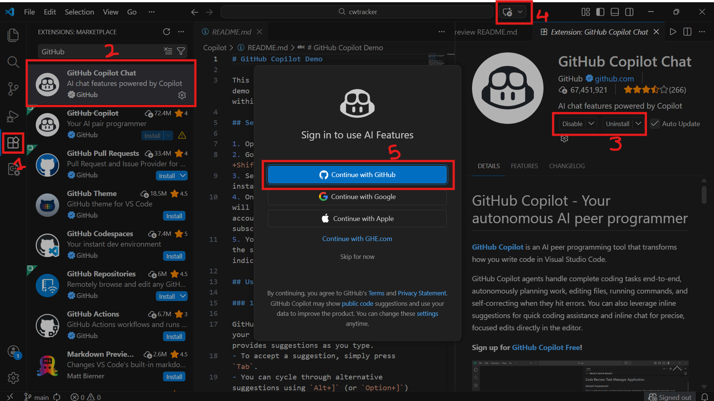
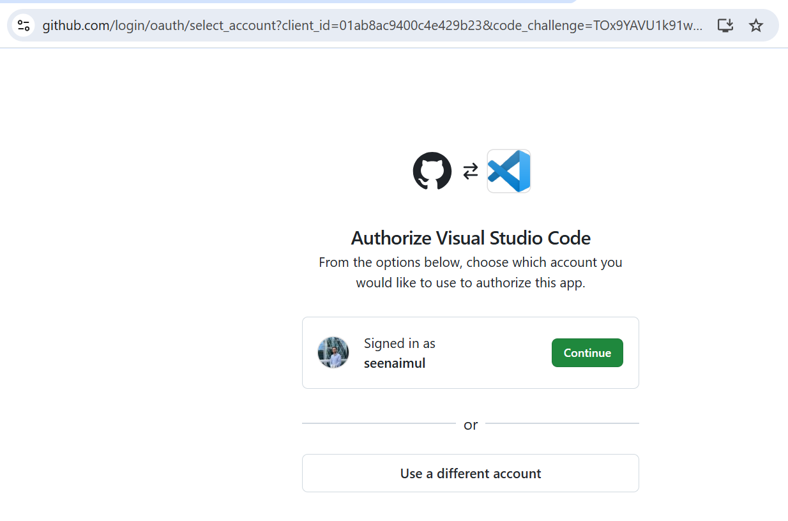
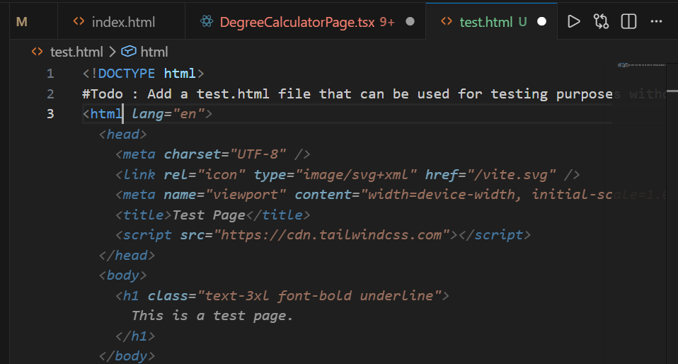
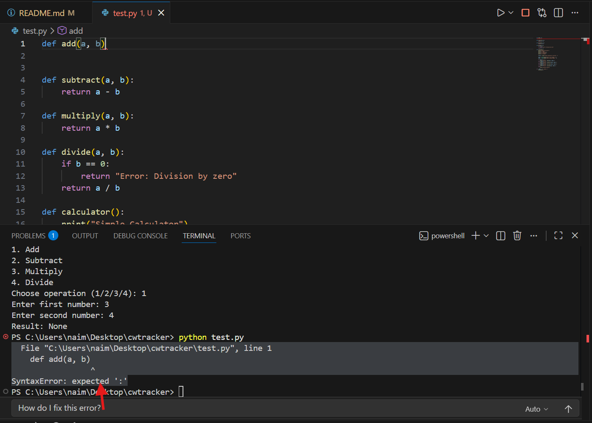
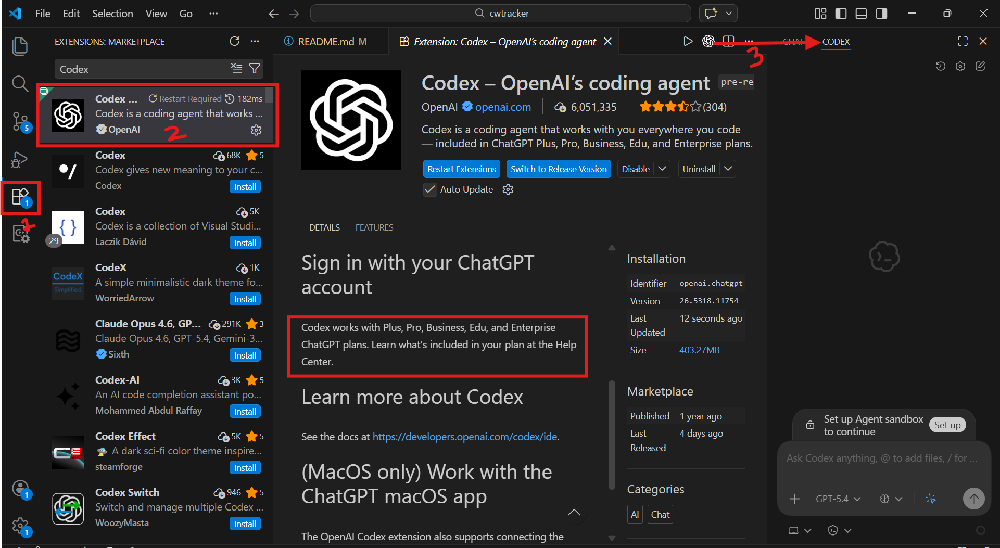

# GitHub Copilot Demo

This guide provides a quick setup and usage demo for **GitHub Copilot** integrated within **VS Code**.

## Setup in VS Code

1. Open **VS Code**.
2. Go to the **Extensions** view (`Ctrl+Shift+X` or `Cmd+Shift+X`).
3. Search for **GitHub Copilot** and install the extension published by GitHub.
4. Once installed, an authentication prompt will appear. Sign in with your GitHub account that has an active Copilot subscription to authorize the extension.
5. You should now see the Copilot icon in the status bar at the bottom right indicating it is active. Or the Chat panel to the right depending VScode version.

   
   

## Usage & Features

### 1. Using VS Code Integration

GitHub Copilot integrates seamlessly into your daily workflow. It continuously provides suggestions as you type. 
- To accept a suggestion, simply press `Tab`. 
- You can cycle through alternative suggestions using `Alt+]` (or `Option+]`) and `Alt+[` (or `Option+[`).

### 2. Explaining Code

You can use the Copilot Chat feature to quickly understand complex logic or unfamiliar code.
- Highlight the block of code you want explained.
- Use `Ctrl+I` (`Cmd+I` on Mac) to bring up inline chat or open the Copilot Chat panel in the sidebar.
- Type `/explain` or ask Copilot "What does this code do?" and it will break down the functionality step-by-step.

### 3. Fixing Code

When you encounter errors, bugs, or exceptions:
- Highlight the problematic code block.
- Ask Copilot via inline chat (`Ctrl+I` or `Cmd+I`) to `/fix` it, or simply ask it "How do I fix this error?".
- Copilot will analyze the error and provide a corrected snippet that you can easily accept and apply. 

### 4. Suggests and completes code based on context and comments

Copilot shines when writing boilerplate or new features.
- Write a descriptive comment outlining what you want the code to do (e.g., `// Function to fetch weather data from an API and parse the JSON response`).
- Press `Enter`, and Copilot will suggest the implementation based on the comment and your current project context.
- Accept the suggestion with `Tab` and modify it if needed!

## OpenAI Codex in VS Code

You can also leverage OpenAI Codex capabilities directly within your editor structure for advanced AI-driven code generation.

> **Note:** Access to GitHub Copilot's most advanced features powered by newer Codex models (or similar OpenAI tiers) usually requires a paid subscription tier, such as Copilot Pro, Enterprise, or specific Plus plans.

