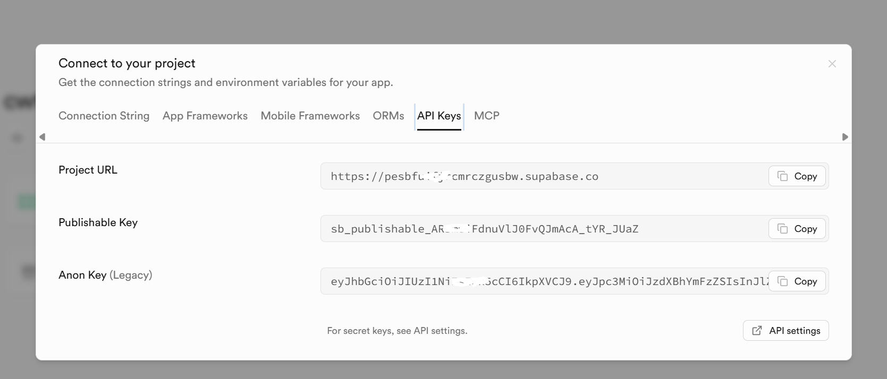
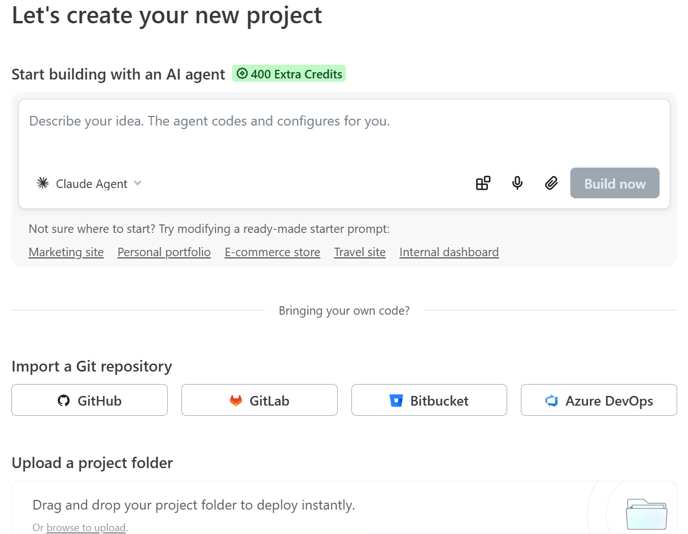
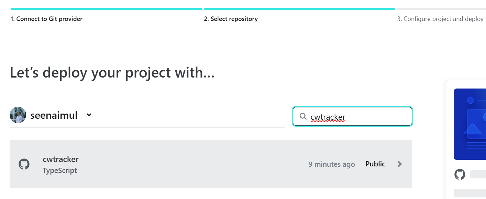
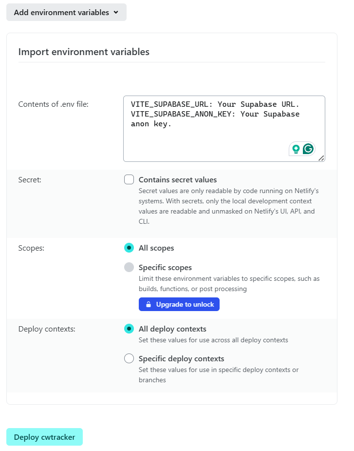

# React Vite Supabase Netlify | CWTracker Project

This project demonstrates the usage of [React](https://react.dev/), [Vite](https://vite.dev/), [Supabase](https://supabase.com/), and [Netlify](https://www.netlify.com/).

## Demo

*([Live Demo is available at: ](https://examcwtracker.netlify.app/#/login))*

## Overview

This project is the CWTracker application built to track coursework and exams, manage alarms & pomodoro timers, calculate degree grades, and more. The primary intention behind this architecture is to provide a modern web application with a fast, responsive user interface and a robust backend.

### Key Features

- **Authentication**: The project includes user authentication using Supabase. This demonstrates how to implement secure sign-up and sign-in functionalities.
- **Coursework Management**: Manage coursework deadlines as events.
- **Grades and Degree Calculator**: Keep track of module grades and calculate degree classifications (On progress).
- **Alarms**: Set alarms for important events with precise, persistent tracking without relying on native browser `alert()` prompts out-of-focus. (On progress)
- **Responsive Design**: The application features a mobile-friendly bottom tab bar, responsive UI, and dark/light modes.
- **Fast Development**: Built using Vite for a fast and efficient module bundling and development experience.

### Decisions and Considerations

- **Supabase Integration**: Supabase was chosen for its powerful backend features, including rapid authentication setup, real-time Postgres changes, and simple database management.
- **Netlify Deployment**: Netlify was selected for deployment due to its simplicity, seamless CI/CD integration with GitHub, and excellent support for modern frontend frameworks like React, and the integratation between GitHub, Supabase and Netlify.

This application serves as a practical example for developers to learn how to build full-stack React applications deployed via Netlify and powered by Supabase.

## Deployment

### Prerequisites

- [GitHub](https://github.com/)
- [Supabase Account](https://supabase.com/)
- [Netlify Account](https://www.netlify.com/)

### GitHub Configuration

1. Push your local `cwtracker` repository to a new repository on GitHub.

### Supabase Configuration

1. Create a new project on [Supabase](https://supabase.com/dashboard).
2. Run the migrations available in the `supabase_setup.sql` file through your project's Supabase SQL Editor to set up your database schema (which creates the `events`, `grades`, and `profiles` tables, alongside their Row Level Security policies). For instructions on how to do this, see [here](https://supabase.com/docs/guides/database/overview#the-sql-editor).
3. Retrieve your project's Database API credentials. Go to Project Settings (the cog icon), open the API tab, and find your API `URL` and `anon` key.

   

### Netlify Deployment

1. Formally verify your GitHub repository is updated with the latest code.
2. Sign in to [Netlify](https://app.netlify.com/) and go to your team Projects dashboard.
3. Click on **Add new project** -> **Import a Git repository**.
4. Choose **GitHub** as your Git provider and authorize Netlify.

   
5. Select your `cwtracker` repository.

   
6. In the build settings configure the following:
-  **Project name**: `cwtracker` to determine the URL of the deployed site. (e.g. `https://examcwtracker.netlify.app/#/login`)
- **Branch to deploy**: `main` or change it to your preferred branch.
   - **Base directory**: *(leave empty)*
   - **Build command**: `npm run build`
   - **Publish directory**: `dist`
7. Click on **Add environment variables** and add the following keys based on your Supabase API credentials:
   - `VITE_SUPABASE_URL`: Your Supabase URL.
   - `VITE_SUPABASE_ANON_KEY`: Your Supabase anon key.
8. Click **Deploy site**.

   

Netlify will now build and deploy the application. Any Pull Request raised on GitHub will have a preview environment generated automatically by Netlify, and these will interact with your single Supabase database instance.

## Developer Documentation

### Postgres Row Level Security

This project uses high-level Authorization using Postgres' Row Level Security.
When you start a Postgres database on Supabase, it is populated with an `auth` schema and some helper functions.
When a user logs in, they are issued a JWT with the role `authenticated` and their UUID.
We can use these details to provide fine-grained control over what each user can and cannot do.

- For documentation on Role-based Access Control, refer to the [docs](https://supabase.com/docs/guides/auth/custom-claims-and-role-based-access-control-rbac).

### Local Development

1. Clone the repository

   ```bash
   git clone https://github.com/${GITHUB_USERNAME}/cwtracker.git
   cd cwtracker
   ```

2. Install dependencies

   ```bash
   npm ci
   ```
   *(or `npm install`)*

3. Set up environment variables

   Go to the Project Settings (the cog icon) in your Supabase dashboard, open the API tab, and find your API URL and `anon` key.

   The `anon` key is your client-side API key. It allows "anonymous access" to your database until the user has logged in. Once they have logged in, the keys will switch to the user's own login token. This enables row-level security for your data.

   Create a `.env` file in the root directory (or copy `.env.example` if available), and add your Supabase environment variables.

   ```sh
   VITE_SUPABASE_URL=your-supabase-url
   VITE_SUPABASE_ANON_KEY=your-supabase-anon-key
   ```

4. Run the development server

   ```bash
   npm run dev
   ```

## Contributing

Contributions are welcome! Please open an issue or submit a pull request.

## License

This project is licensed under the MIT License.

## Support Information

- [React Docs](https://react.dev/docs)
- [Supabase Docs](https://supabase.com/docs)
- [Netlify Docs](https://docs.netlify.com/)
- [Vite Docs](https://vitejs.dev/guide/)
